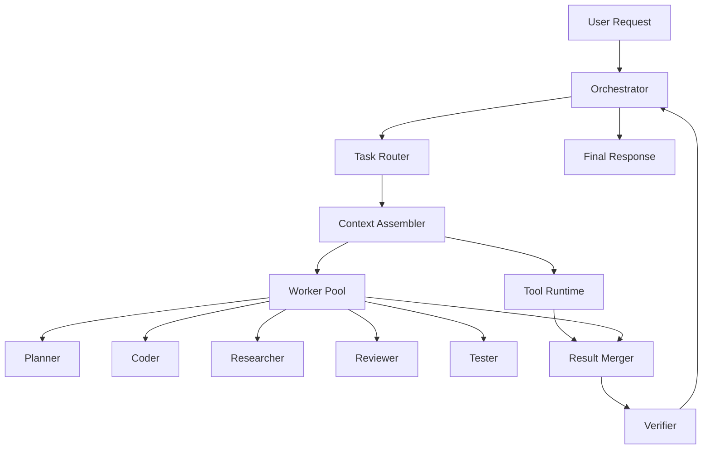

# Chorus-cli

**Chorus-cli** is a high-performance, local-first interactive agent harness designed for production coding tasks. It leverages modern LLMs (primarily Ollama-based) and a multi-agent orchestration layer to solve complex software engineering problems with precision and efficiency.

---

## 🚀 Key Features

- **Multi-Agent Orchestration**: Specialized workers (`planner`, `coder`, `researcher`, `reviewer`, `tester`) collaborate to execute complex tasks.
- **Local-First & Private**: Optimized for local LLM runtimes like Ollama, ensuring your code stays on your machine.
- **TUI Powered by Ink**: A responsive, scrolling terminal interface built with React (Ink), featuring collapsible thinking blocks and interactive tool cards.
- **Intelligent Context Management**: Automatic context compaction and summarization keep your token usage efficient.
- **Safety & HITL**: Built-in Human-In-The-Loop (HITL) approval flows for high-risk operations like file writes and shell commands.
- **Slash Commands & Mentions**: Intuitive CLI control with `/commands` and `@file` mentions to ground the agent in your codebase.

---

## 🛠 Architecture Overview

Chorus-cli follows a sophisticated "Harness" model that separates task routing from execution.



For more details, see the [Architecture Documentation](.planning/codebase/ARCHITECTURE.md).

---

## 📦 Getting Started

### Prerequisites
- **Node.js**: v18 or later.
- **Ollama**: Installed and running locally.
- **Model**: `batiai/gemma4-e2b:q4` (default) or any compatible model pulled in Ollama.

### Installation
1. Clone the repository.
2. Install dependencies:
   ```bash
   npm install
   ```
3. (Optional) Configure environment variables in a `.env` file (see `.env.example`).

### Running the CLI
Start the CLI in development mode:
```bash
npm run dev
```

Or build and start:
```bash
npm run build
npm start
```

---

## 📖 Documentation

- **[User Handbook](HANDBOOK.md)**: A detailed guide on every feature and how to use the CLI.
- **[Harness Implementation Guide](docs/LLM-HARNESS-IMPLEMENTATION-GUIDE.md)**: Deep dive into the orchestration logic.
- **[Technology Stack](.planning/codebase/STACK.md)**: Detailed breakdown of the tools and libraries used.

---

## 🛡 Security & Safety

Chorus-cli is designed with safety in mind:
- **Workspace Confinement**: Filesystem and shell tools are restricted to the current working directory.
- **Secret Protection**: Automatic blocking of sensitive files (e.g., `.env`, `.pem`, SSH keys) during mention expansion.
- **Approval Policies**: Configure the agent to ask for permission before performing mutating actions.

---

## 📄 License

Chorus-cli is released under the [MIT License](LICENSE).
