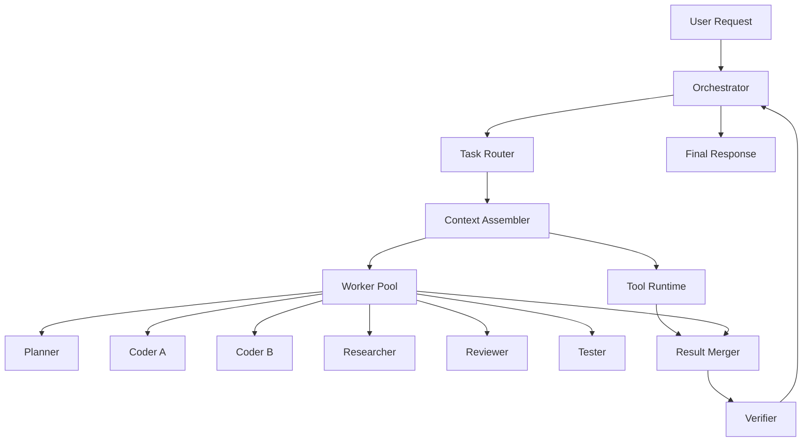
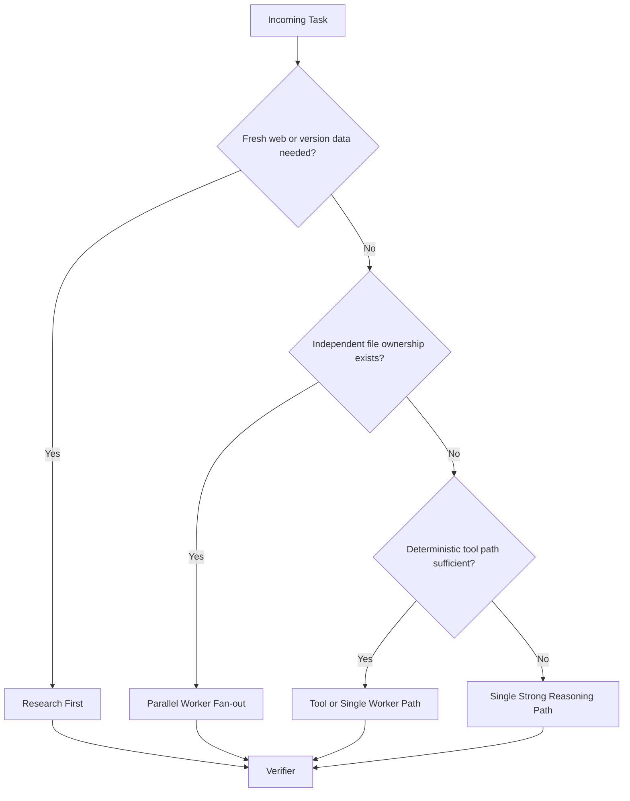

# LLM Harness Implementation Guide

## Who Is This For

- Developers implementing the control plane, worker lifecycle, and tool runtime for a coding agent.
- QA engineers defining behavioral, concurrency, and cost-regression test coverage.
- Platform engineers operating the inference, cache, and background-job layers.
- Reviewers evaluating whether the harness is efficient in a measurable way rather than only architecturally plausible.

## Part 1: Overview

## Overview

| Attribute | Value |
| --- | --- |
| System | Multi-agent coding harness |
| Primary Goal | Solve coding tasks with minimum latency, token waste, and orchestration overhead |
| Main Actor | `orchestrator` |
| Secondary Actors | `planner`, `coder`, `researcher`, `reviewer`, `tester` |
| Deterministic Subsystems | tool runtime, cache manager, job router, memory store, observability pipeline |
| Efficiency Focus | prefix reuse, fewer model calls, bounded worker contexts, asynchronous long-job execution |
| Recommended Deployment | Hybrid: hosted API control plane with optional self-hosted inference backend for high-throughput workloads |
| Local Development Option | Ollama as inference backend behind a provider adapter |

The harness should center all user interaction on a single `orchestrator`. Worker agents exist to reduce wall-clock time on independent subproblems, not to multiply reasoning for its own sake. The orchestrator owns the only canonical task graph, the only user-visible transcript, and the only final decision about when to answer, continue, verify, or stop.



## Pre-Conditions

| Condition | Why It Matters | Source |
| --- | --- | --- |
| Stable tool contracts exist for filesystem, git, shell, search, and test execution | Prevents the model from spending tokens rediscovering how the environment works | Required harness design |
| Each worker receives a bounded scope with explicit ownership | Avoids duplicate work, merge conflicts, and full-context replay | Inferred from efficient multi-agent operation |
| Structured output schemas are enforced for all worker responses | Eliminates retry loops caused by free-form responses and makes orchestration deterministic | Current best practice from structured-output APIs |
| Prompt prefix is kept stable across turns | Required for hosted prompt caching and self-hosted KV/prefix caching | Inferred from provider and engine cache mechanisms |
| Long-running tasks can be moved off the synchronous request path | Prevents user-facing timeouts and preserves responsiveness | Inferred from modern background execution primitives |

## Part 2: Control Plane

## 1. Core Components

| Component | Responsibility | Key Interaction |
| --- | --- | --- |
| `orchestrator` | Owns user turn, task graph, final answer, and escalation policy | Calls router, tool runtime, workers, and verifier |
| `task-router` | Chooses execution lane, model tier, and whether multi-agent fan-out is justified | Runs before any expensive model call |
| `context-assembler` | Builds stable prefix plus task-local delta | Reads memory store, repo facts, task metadata, and live user input |
| `worker-pool` | Runs bounded subtasks in parallel | Receives typed task specs from orchestrator |
| `tool-runtime` | Executes deterministic work outside the model | Provides filesystem, git, shell, search, and test operations |
| `result-merger` | Normalizes worker and tool outputs into one task state | Produces verifier-ready synthesis input |
| `verifier` | Checks that the result satisfies task intent and catches obvious regressions | Can request more work or approve final answer |
| `memory-store` | Stores durable repo facts, session state, and compacted task history | Serves context assembler and router |
| `observability-pipeline` | Tracks latency, cost, cache, and correctness metrics | Receives data from every layer |

## 1A. Local Ollama Deployment

| Decision | Recommendation | Why |
| --- | --- | --- |
| Use Ollama locally | Yes, for single-user or low-concurrency development | Lowest setup friction and good privacy |
| Couple harness logic directly to Ollama APIs | No | Makes future migration to hosted or high-throughput backends expensive |
| Put Ollama behind `LLMProvider` | Yes | Keeps orchestration, routing, and worker logic backend-agnostic |
| Use Ollama for high-concurrency production fan-out | Usually no | Limited scheduling and cache-control surface compared with specialized serving engines |

Ollama is a reasonable local inference backend for a coding agent. The important design rule is that the harness should depend on a provider interface, not on Ollama-specific request shapes. That lets the same orchestrator and worker contracts later target hosted APIs, `vLLM`, or `SGLang` without rewriting task routing and verification behavior.

## 2. Execution Lanes

| Lane | Use When | Expected Tradeoff |
| --- | --- | --- |
| `foreground_sync` | Interactive coding turn needs immediate response | Highest responsiveness, highest cost sensitivity |
| `background_async` | Long reasoning, repo-wide scans, or large verification jobs are needed | Better reliability, slower first visible output |
| `batch_offline` | Evaluations, indexing, nightly audits, or mass transformations | Lowest cost per request, no immediate response |
| `cheap_triage` | Routing, summarization, extraction, and low-risk classification | Lower quality ceiling, large cost and latency savings |

The router should treat execution-lane selection as a first-class decision. A harness that routes every task through the same synchronous, high-end path is not optimized regardless of model quality.

## 3. Worker Types

| Worker | Role | Typical Input | Typical Output |
| --- | --- | --- | --- |
| `planner` | Break task into bounded steps and dependencies | user intent, current repo facts, high-level diff target | task graph, file ownership map, verification criteria |
| `coder` | Make scoped code changes | owned file set, implementation task, local context bundle | changed files, implementation summary, unresolved risks |
| `researcher` | Fetch external docs, versions, and API behavior | query spec, source constraints, freshness requirement | cited findings, compatibility notes, recommendations |
| `reviewer` | Scan modified surface for bugs, regressions, and missing tests | changed file set, test results, task intent | findings, severity, required fixes |
| `tester` | Generate or run validation actions | changed file set, verification criteria | test outcomes, failures, coverage gaps |

Each worker must be read- or write-scoped. A `coder` can own `src/api/**` while another owns `src/ui/**`. A `reviewer` should be read-only. The orchestrator should reject overlapping write scopes unless the task explicitly requires serialized ownership transfer.

## Part 3: Request Flow

## 4. Validation Chain

| # | Check | Entity/Repository | Failure Message / HTTP Code |
| --- | --- | --- | --- |
| 1 | Is the task trivial enough to answer without model or workers | `task-router` | `route=deterministic_only` |
| 2 | Does the task require fresh external information | `task-router` | `route=research_required` |
| 3 | Can the task be solved with one worker or deterministic tools only | `task-router` | `route=single_path` |
| 4 | Are there independent subproblems with disjoint ownership | `planner` or `task-router` | `route=no_parallel_fanout` |
| 5 | Is the stable prompt prefix available in cache-friendly form | `context-assembler` | `cache_prefix_misaligned` |
| 6 | Does the task exceed synchronous latency budget | `task-router` | `route=background_async` |
| 7 | Are required tool contracts available and healthy | `tool-runtime` | `tool_unavailable` |
| 8 | Did each worker return schema-valid output | `result-merger` | `worker_output_invalid` |
| 9 | Does merged result satisfy verification criteria | `verifier` | `verification_failed` |

The purpose of this chain is to stop wasted inference early. The harness should reject unnecessary fan-out, reject malformed worker outputs, and reject unbounded context assembly before expensive reasoning begins.

## 5. Type Determination

| Decision Input | Rule | Resulting Path |
| --- | --- | --- |
| Single file or single deterministic action | No worker fan-out needed | `tool_or_single_worker_path` |
| Multiple independent file sets | Parallel work is allowed | `parallel_multi_worker_path` |
| Repo-wide understanding needed before coding | Research or planning first | `research_then_plan_path` |
| Long-running scan or evaluation | Move off foreground | `background_or_batch_path` |
| Large repeated prefix and stable schema | Favor cache-optimized path | `cache_amplified_path` |



## 6. Save Path - Entity

### `TaskRecord`

| Field | Value | Source | Notes |
| --- | --- | --- | --- |
| `task_id` | Generated per user turn | orchestrator | Stable across all child work |
| `status` | `queued`, `running`, `blocked`, `verifying`, `completed`, `failed` | orchestrator | Canonical task state |
| `lane` | One of the execution lanes | task-router | Needed for cost and SLA analysis |
| `owner` | `orchestrator` | system | Unchanged for entire task |
| `verification_criteria` | Planned acceptance checks | planner | **Differentiating field** because it prevents “code complete but task incomplete” states |

### `WorkerAssignment`

| Field | Value | Source | Notes |
| --- | --- | --- | --- |
| `worker_id` | Generated per spawn | worker-pool | Unique child identifier |
| `role` | `planner`, `coder`, `researcher`, `reviewer`, `tester` | orchestrator | Determines prompt and tool access |
| `owned_scope` | File globs, modules, or read-only boundary | planner or orchestrator | Must be explicit |
| `input_bundle_id` | Reference to prepared task-local context | context-assembler | Avoids copying full context |
| `status` | `queued`, `running`, `completed`, `failed` | worker runtime | Used in orchestration progress |

### `ContextBundle`

| Field | Value | Source | Notes |
| --- | --- | --- | --- |
| `prefix_hash` | Stable hash over system/tools/schema/static examples | context-assembler | Cache affinity key |
| `task_delta` | User message, diff, recent findings | live task state | Changes every turn |
| `repo_facts_version` | Snapshot identifier | memory-store | Lets workers share compact repo understanding |
| `compaction_ref` | Optional compacted conversation reference | memory-store | Used when thread grows |
| `tool_schema_version` | Current tool contract version | tool-runtime | Prevents stale assumptions |

## Part 4: Data and Cache Strategy

## 7. Cache and Memory Design

| Layer | Purpose | Mutation Pattern | Notes |
| --- | --- | --- | --- |
| `prefix-cache` | Reuse static prompt prefix | Rarely changes | Must include tools, system prompt, and output schemas first |
| `conversation-state` | Preserve recent interactive thread | Appends each turn | Provider-native state is preferable when available |
| `compaction-state` | Shrink old turn history without losing task continuity | Periodic | Used before context becomes a latency problem |
| `repo-fact-memory` | Durable architecture facts, user preferences, project rules | Slow-changing | Should be curated, not raw transcript dumps |
| `task-working-memory` | Current TODOs, file ownership, unresolved risks | High churn | Lives only while task is active |

### Cache Key Policy

| Cache Key | Composition | Why It Exists |
| --- | --- | --- |
| `prefix_hash` | system prompt + tool schema + response schema + stable examples | Maximizes provider prompt caching and self-hosted KV reuse |
| `task_shape_key` | task class + repo fact version + worker role | Enables reuse of routing and planning templates |
| `prediction_key` | current file text hash + transformation intent | Supports predicted-output style code regeneration |
| `worker_context_key` | owned scope + task delta + role | Prevents duplicate bundle assembly |

### What This Path Does Not Cover

- Fine-grained GPU kernel tuning inside a custom inference engine.
- Training or fine-tuning of the underlying base model.
- Human approval workflows for production code merges.
- Secrets-management design beyond normal tool-runtime boundaries.

## Part 5: Worker Contracts

## 8. Worker Output Contract

Every worker should return a schema-valid object with no free-form outer wrapper.

```json
{
  "status": "completed",
  "summary": "Implemented scoped change",
  "changed_files": ["src/example.ts"],
  "findings": [],
  "risks": [],
  "next_actions": [],
  "verification": {
    "checks_run": [],
    "checks_pending": []
  }
}
```

| Field | Meaning | Data Impact | User/System Outcome |
| --- | --- | --- | --- |
| `status` | Worker terminal state | Controls merger behavior | Invalid or missing status blocks orchestration |
| `summary` | Short natural-language description | Stored in task history | Used for final synthesis |
| `changed_files` | Files actually modified or proposed | Enables reviewer/tester targeting | Prevents repo-wide rescans |
| `findings` | Bugs, blockers, incompatibilities | Drives escalation | Lets orchestrator decide whether to continue or answer |
| `risks` | Known residual uncertainty | Preserved for final answer | Prevents false confidence |
| `next_actions` | Required follow-up steps | Shapes next task graph | Avoids another planning round |
| `verification` | Checks executed or still needed | Used by verifier | Makes completion measurable |

## 9. Tool Runtime Contract

| Component | Responsibility | Key Interaction |
| --- | --- | --- |
| `filesystem` | read, write, search, list | Used by coder, reviewer, tester |
| `git` | diff, status, log, branch metadata | Used by reviewer and orchestrator |
| `shell` | bounded command execution | Used for build, test, lint, and targeted scripts |
| `web-research` | fresh external documentation and version data | Used by researcher only when needed |
| `index-search` | semantic or lexical repo retrieval | Used by context assembler and workers |

The tool runtime should be deterministic and aggressively typed. The harness should prefer tools over model reasoning whenever the task is mechanical.

## 9A. Provider Adapter Contract

| Component | Responsibility | Key Interaction |
| --- | --- | --- |
| `LLMProvider` | Stable interface for generation, streaming, and health | Used by orchestrator and workers |
| `OllamaProvider` | Local adapter over Ollama HTTP APIs | Uses current `src/ollama/client.ts` behavior |
| `ProviderRegistry` | Chooses configured backend per lane or model tier | Used by task router |

The provider adapter isolates backend differences such as request format, streaming protocol, authentication, and health checks. The harness should never scatter Ollama-specific logic through workers, tools, or memory code.

## Part 6: Real-World Scenario

## 10. Narrative Scenario

Rafiq asks the harness to add API pagination to `src/api/issues.ts`, update the CLI renderer in `src/cli/components/Feed.tsx`, and verify test coverage. The orchestrator first classifies the request as a coding task with two disjoint write scopes and one verification path. It chooses `foreground_sync`, creates a `TaskRecord`, and asks the `planner` to define file ownership and verification criteria. The planner returns two coder scopes: `coder-a` owns `src/api/**`; `coder-b` owns `src/cli/components/**`; `tester` is read-only and will run after both coders finish.

The context assembler builds a stable prefix containing system instructions, tool schemas, worker schema, and project policy. It appends only the user request, relevant diffs, and local file context. `coder-a` and `coder-b` run in parallel with separate `ContextBundle` objects. `coder-a` changes request parsing and response shape. `coder-b` adjusts rendering for paginated results. Both return typed outputs with `changed_files`, `risks`, and `checks_pending`.

The result merger combines both outputs and dispatches the `tester` to run only the impacted checks. The `reviewer` scans the changed surface for boundary regressions. The verifier compares merged output against the planner’s acceptance criteria: pagination parameters exist, renderer handles next-page state, and tests cover both paths. Only when those checks pass does the orchestrator produce the final answer to Rafiq.

## Part 7: Key Differences

## 11. Key Differences

| Dimension | This Workflow | Related Workflow |
| --- | --- | --- |
| User interaction model | One canonical orchestrator thread | Fully autonomous swarm with no central owner |
| Worker scope | Explicitly bounded by file/module ownership | Broad “figure it out” prompts |
| Memory strategy | Prefix-stable context plus compaction and repo facts | Full transcript replay |
| Verification | Required explicit verifier gate | Best-effort self-report by workers |
| Efficiency mechanism | Fewer model calls, cache amplification, asynchronous long jobs | More agents and more tokens |
| Failure containment | Schema validation and scoped retries | Open-ended conversational recovery |

## 12. Final State Summary

| State | Meaning | Data Impact | User/System Outcome |
| --- | --- | --- | --- |
| `completed` | Verifier accepted task result | Task, worker, and context state persisted | User receives final answer |
| `failed` | Task cannot continue safely | Failure cause stored | User receives blocker explanation |
| `blocked` | Missing tool, permission, or external dependency | Partial progress preserved | User receives targeted unblock request |
| `backgrounded` | Work moved to async path | Response ID or job ID stored | User receives progress reference or later result |

## 13. Key Classes/Repos

| Component | Responsibility | Key Interaction |
| --- | --- | --- |
| `Orchestrator` | Owns turn lifecycle | Talks to all major subsystems |
| `TaskRouter` | Chooses lane and model tier | Runs before costly execution |
| `ContextAssembler` | Produces cache-friendly worker bundles | Reads memory and repo index |
| `WorkerPool` | Spawns and tracks specialized workers | Enforces scope ownership |
| `ResultMerger` | Normalizes child outputs | Feeds verifier |
| `Verifier` | Enforces task completion bar | Gates final answer |
| `MemoryStore` | Stores task, repo, and compacted session knowledge | Feeds future requests |
| `ObservabilityPipeline` | Tracks latency, cost, correctness, and cache signals | Supports optimization decisions |

## Part 8: Operational Metrics

## 14. Metrics and Guardrails

| Metric | Why It Matters | Expected Use |
| --- | --- | --- |
| `cache_hit_rate` | Proves prefix strategy is working | Tune prompt layout and routing |
| `cached_tokens` | Measures provider-side prefix reuse | Spot regressions in prompt stability |
| `tokens_per_successful_task` | Core efficiency signal | Compare routing policies |
| `model_calls_per_task` | Detects orchestration waste | Reduce unnecessary fan-out |
| `verification_failure_rate` | Measures false completions | Tighten planner or reviewer role |
| `prefill_latency_ms` | Shows context assembly and cache impact | Justify compaction and prefix reuse |
| `decode_tokens_per_second` | Shows inference speed | Compare provider and self-hosted backends |
| `background_offload_rate` | Measures async lane usage | Keep sync path responsive |

The harness should treat these metrics as product requirements. If the implementation cannot show that `model_calls_per_task` and `tokens_per_successful_task` are falling while task success remains stable, it is not yet efficient.

## Related Documents

- [SPEC.md](./SPEC.md) — Current product-level CLI specification and historical notes.
- [PLAN.md](./PLAN.md) — Historical implementation plan for the existing project shape.
